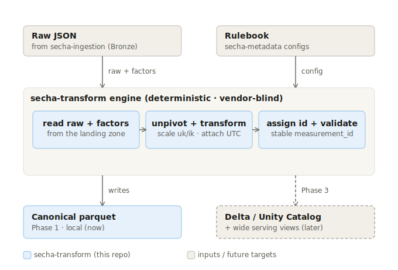

# secha-transform

> The **deterministic, config-driven transform engine** for SECHA: raw vendor data → canonical.

`secha-transform` reads **raw** data (from the `secha-ingestion` landing zone) plus the **rulebook**
(`secha-metadata`) and produces **canonical** rows. It is a *deterministic interpreter of metadata*:
**no vendor logic lives in the engine**. Swap a config, get different output, zero code change. That
decoupling is the central interoperability claim of the thesis, demonstrated with two vendors.

## Architecture at a glance



Two inputs meet at the engine: **raw data** from `secha-ingestion` and the **rulebook** from
`secha-metadata`. The source schema's descriptors drive everything: `access.layout` resolves the
landing partitions, `format:` selects the parser (JSON or tab-separated triples), and `shape:`
selects the mapping style. Wide records (MX Electrix) are **unpivoted** into long rows while
transforms apply (scale by `uk`/`ik`, attach UTC); long records (ProCem) are resolved by a **keyed
lookup** in the mapping's `rows:` table (epoch-ms timestamps, per-row aggregation). Every row gets
a stable `measurement_id` and lands as canonical rows: **parquet locally now (Phase 1)**, Delta /
Unity Catalog with wide serving views later (Phase 3).

## Where this fits in the SECHA system
```
secha-ingestion  →  raw data (Bronze)
secha-metadata   →  the transformation rulebook (config-as-code)
secha-transform  →  reads raw + rulebook → canonical (Delta / Unity Catalog)   ← this repo
```

## What it does (two source shapes, one canonical form)
**Wide sources:** one record (e.g. ~240 MX Electrix columns) is **unpivoted into many long canonical
rows**, one per measured quantity. **Long sources:** each record is already one reading (a ProCem
`(rtl_id, value, epoch_ms)` triple); the mapping's `rows:` table gives it meaning. Either way each
canonical row is self-describing: `quantity · phase · variant · harmonic_order` + `value` + `unit`,
tagged with its source provenance and a deterministic `measurement_id`. The same physical thing
always takes the same row shape across vendors, which is what makes the data interoperable.

**On the canonical shape (long vs wide).** Only `quantity` (with `value` and `unit`) carries meaning for
most variables. `phase` and `variant` sit at `none` and `harmonic_order` is `null` unless the row is a
phase-resolved or harmonic power-quality reading, so non-PQ data (a battery state-of-charge, a price)
only sets `quantity`. The long form is the **interoperability substrate**, not what consumers query:
Phase 3 builds **wide serving views** (one column per quantity) shaped per use case, so analysts get a
friendly wide table while the long form does the flexible plumbing underneath.

## Proven end-to-end (two vendors, one canonical table)
- **MX Electrix** (wide JSON API): a full real day, **1,440 one-minute records → ~36,000 canonical
  rows** (unpivot fan-out).
- **ProCem Kampusareena** (long 1 Hz file triples): a full real day, **14,476,804 records →
  5,499,568 canonical rows** (keyed lookup; 8,977,236 records for not-yet-mapped rtl_ids counted,
  never silent; mapped + unmapped = records in, exactly).
- **The convergence query**: one filter (`quantity=voltage, phase=L1`) returns both vendors in
  identical shape: `mx_electrix:meter:21 → 237.20 V` and `procem:kampusareena:evcharging →
  234.57 V`, same columns, same semantics. That single result is the interoperability claim, live.
- Golden tests assert the engine reproduces the exact canonical rows defined by the
  `secha-metadata` contract for **both** vendors.

## Principles
- **Deterministic & pure.** `transform_records(records, bundle, factors)` is a pure function;
  same input + same config gives identical output (apart from the `ingested_at` stamp).
- **Vendor-blind.** The engine never contains a vendor name or `if vendor == …`; all vendor knowledge
  comes from the `secha-metadata` bundle it loads.
- **Idempotent.** `measurement_id` is a hash of the identity tuple, so re-runs MERGE safely.
- **Config is the contract.** The engine must satisfy the golden fixtures defined in `secha-metadata`.
- **Loud, never silent.** Declared transforms, formats, or rules the engine cannot honour raise;
  skipped or unmapped data is counted in the run stats, never dropped invisibly.

## Layout
```
src/secha_transform/
  metadata/   loader.py: load the rulebook into a MetadataBundle
  engine/     transform.py (the pure transform) + validation.py (rule application)
              + models.py (CanonicalRow, TransformResult) + identity.py
  io/         reader.py (descriptor-driven landing reader) + writer.py (canonical parquet)
  config.py   pydantic-settings (env-prefixed SECHA_)
  cli.py      typer entrypoint (one subcommand per vendor; batching for huge days)
tests/        golden per vendor (vs secha-metadata) + validation + IO + unit tests
docs/         architecture diagram
```

## Build phases
- **Phase 1 (done):** pure-Python engine; **golden tests green** against the `secha-metadata`
  contract; the sink writes a local **parquet** dataset (the columnar form Delta stores).
- **Phase 2 (done):** the engine applies `validation.yaml`: record rules (`not_null` → reject) run on
  the raw record, quantity rules (`range` → flag `suspect` / drop / reject) run on emitted values; every
  outcome is **counted** in the run stats (`TransformResult.stats`), and a declared rule the engine
  cannot honour **raises**. Remaining primitives are added as column families are mapped.
- **Phase 3 (done, live on the TUNI cluster):** Delta / Unity Catalog via Spark Connect (the `spark`
  extra, pinned `pyspark-client==4.1.1`). `io/delta_sink.py` generates the table DDL from
  `canonical_schema.yaml` + the target's `table_properties` (incl. the platform-required
  `delta.feature.catalogManaged`), reads cluster-visible staging parquet, dedupes on the merge key
  (latest `ingested_at` wins), and `MERGE`s on `measurement_id`. Serving definitions come from the
  rulebook's `serving/*.sql` (`{canonical}` placeholder), materialised per the target's
  `serving_mode` (Delta snapshots here: this UC connector lacks views and RTAS). Reference
  dimensions (e.g. `secha.canonical.quantity`) are published from the rulebook vocabularies so
  consumers JOIN the long fact for descriptions + standards.
  CLI: `delta-load`, `delta-views` (dimensions + serving), and `--sink delta` on the vendor commands.
  **Verified live:** `secha.canonical.measurement` holds 5,535,568 rows (both vendors; re-running
  the load reports `5535568 -> 5535568`, the platform-level idempotency proof) and
  `secha.serving.pq_minute_wide` answers the convergence query. Full record:
  [docs/phase3-log.md](docs/phase3-log.md).

## Configuration
All settings are environment variables prefixed `SECHA_` (read from `.env`; see `.env.template`). None
are secrets; they are just paths.

| Variable | Default | Purpose |
|---|---|---|
| `SECHA_METADATA_ROOT` | `../secha-metadata` | the rulebook checkout the engine interprets |
| `SECHA_LANDING_ROOT` | `data/landing` | raw zone (usually `../secha-ingestion/data/landing`) |
| `SECHA_CANONICAL_ROOT` | `data/canonical` | Phase-1 local canonical parquet output |
| `SECHA_SPARK_URL` | unset | Phase 3: Spark Connect endpoint (TUNI VPN) |
| `SECHA_CATALOG_URL` | unset | Phase 3: Unity Catalog API |
| `SECHA_CATALOG_TOKEN` | unset | Phase 3: UC token (secret; `.env` only) |
| `SECHA_STAGING_ROOT` | unset | Phase 3: cluster-visible staging path for canonical parquet |

## Develop & run
```bash
uv sync --dev
uv run pytest                       # golden (needs secha-metadata) + self-contained unit tests
uv run ruff check . && uv run ruff format --check .
uv run mypy src
uv run secha-transform mx-electrix --date 2025-08-15 --meter 21   # raw landing -> canonical parquet
uv run secha-transform procem --date 2026-06-15                   # streams + batches 14.5M records

# Phase 3 (needs the spark extra + .env platform values + TUNI VPN):
uv run secha-transform delta-load --staging /net/nfs/data/secha/canonical-staging/load-001
uv run secha-transform delta-views                                # publish reference dimensions + serving snapshots
```
(No uv? `python -m venv .venv && .venv/Scripts/pip install -e . && .venv/Scripts/pip install pytest mypy ruff`,
then run the same commands without the `uv run` prefix.)

> A run only transforms what `secha-ingestion` has already **landed** for that date/meter. If nothing is
> landed you get `Transformed 0 record(s)`; land the day first with `secha-ingest`. Re-running the same
> date/meter **replaces** that run's output (run-scoped part files); when a partition holds several landed
> snapshots, the reader uses only the **latest** one (by the envelope's `fetched_at`).

The golden tests read the contract from `SECHA_METADATA_ROOT` (defaults to the sibling `secha-metadata`
checkout); the unit tests need nothing external.

## Adding a new vendor
No engine change. Add the vendor's config in `secha-metadata` (source schema, mapping, validation) and,
if needed, a CLI subcommand here. The engine already interprets any well-formed bundle, wide or long.
That "new vendor = config, not code" property is the transform-side proof of the framework's
decoupling claim; the ProCem onboarding demonstrated it with three generic engine capabilities and
zero vendor logic (measured in `secha-metadata`'s `docs/onboarding-diary-procem.md`).

## Status / open items
- **Scope:** two vendors, MX Electrix (wide JSON) and ProCem Kampusareena (long DSV triples).
  Primitives implemented: unpivot (wide), **keyed `rows:` lookup (long)** with per-row aggregation
  override, `none`, `scale_by_factor`, `parse_decimal`, timestamps (`iso8601`, **`epoch_ms`/`epoch_s`**
  with exact integer math), descriptor-driven reading (`access.layout` + `format:` incl. header-less
  DSV), latest-snapshot selection, streaming/batched processing for multi-million-row days, and
  **validation application** (flag/drop/reject with counted run stats). Unimplemented transforms,
  formats, and rules fail loudly. `grep -ril procem src/` matches only the CLI command wiring;
  the engine and IO layers contain zero vendor logic.
- **Phase 3 is live.** Operational notes: platform commands need the TUNI VPN + a Unity Catalog token
  in `.env`; staged canonical parquet must sit on the cluster NFS (`/net/nfs`); serving snapshots are
  refreshed by re-running `delta-views` after each `delta-load`. Platform runbook + facts learned:
  [scripts/phase3/README.md](scripts/phase3/README.md) and [docs/phase3-log.md](docs/phase3-log.md).
